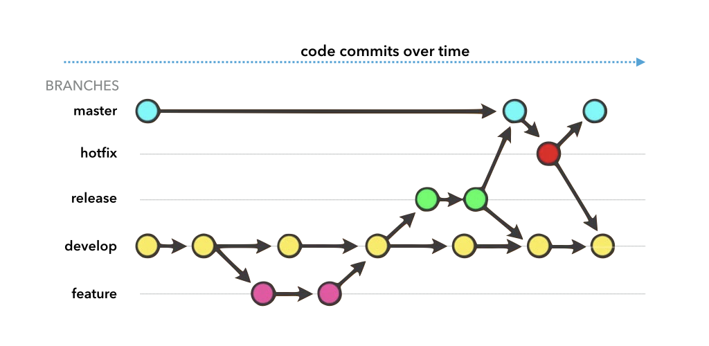

---?image=http://f52.tech/_nuxt/img/f52_welcome.2393ff7.jpg&size=cover

<span class="menu-title" style="display: none;">Débuter avec Git et Git-flow</span>

## <span style="color: white;"> Débuter avec git<br/>et git-flow</span>

<span style="color: lightgray;">Cédric Foellmi – F52 Technologies<br/>cedric@f52.tech –</span> http://f52.tech

---

## Table des matières

* Les principes de git
* Les commandes de base
* Le git-flow
<hr>
* Les <span class="code">remotes</span> et les plateformes (GitHub...)
* Collaborer
<hr>
* Quelques exemples de clients
* Une *pull request* sur GitHub


---

<span class="menu-title" style="display: none">Historique 1</span>

Git a débuté en 2005 après que Linus Torvald, le créateur de Linux, a dû
renoncer à son système de contrôle de version, devenu payant.

"git" veut dire "personne désagréable" en anglais argotique.

> I'm an egotistical bastard, and I name all my projects after myself. First 'Linux', now 'git'.

-- Linus Torvald

---

<span class="menu-title" style="display: none">Historique 2</span>

* le développement commença le **3 avril 2005**,
* il fut annoncé **le 6**,
* est devenu son propre contrôleur de version **le 7**,
* le premier `merge` eut lieu **le 18**,
* **le 29**, les objectifs de performance sont atteints
* **le 16 juin**, git gère la release du kernel Linux 2.6.12
* **le 26 juillet**, la maintenance est transferrée à Junio Hamano...
* la v1.0 sort le **21 décembre**.

<center></center>

<small>Source: Wikipedia</small>

---

## Les Principes

---

<span class="menu-title" style="display: none">Les principes I</span>

### git est un système de contrôle de version *distribué*.


Avantages:

* Pas besoin de serveur central, pas de "single point of failure"
* Permet de continuer à travailler hors-ligne
* Cloner un dépôt signifie obtenir l'entiereté du projet, historique compris.
* **(Presque) tout se passe "localement"**

---

<span class="menu-title" style="display: none">Les principes II</span>

### git fonctionne comme un mini "système de fichiers".

* Les fichiers eux-mêmes sont conservés au moment du `commit`, pas seulement des différences
* Git est conçu pour le code, et le texte. Pas pour les binaires (images, PDFs...)

Diff | Git
---- | ---
 | 

---

<span class="menu-title" style="display: none">Les principes III</span>

### git assure une entière intégrité des données

* Git "checksum" tout avant de commiter.
* Git généralement ajoute des données. Il est très difficile de retirer (ou de perdre) quelque chose, une fois commité.

---

<span class="menu-title" style="display: none">Les principes IV</span>

### git fonctionne avec 3 niveaux


* **commité**: le fichier est enregistré dans la chaîne de commits.
* ** *staged* ou mis à l'index**: le fichier est marqué pour partir avec le prochain commit.
* **modifié**: le fichier diffère de sa précédente copie.

<small>Logiquement, tout fichier nouveau, renommé, déplacé ou effacé est considéré comme "*modifié*".</small>

<small>Sauf s'il est explicitement "*ignoré*"...</small>

---

<span class="menu-title" style="display: none">Les principes V</span>

### Les différents états pour les fichiers


---

## Des questions sur Les Principes ?

---

## Ok, les bases

---

<span class="menu-title" style="display: none">Un (tout petit) peu de config</span>

### Un (tout petit) peu de config

<small>Pas obligatoire mais évite des soucis par la suite.</small>

* Le fichier **`.gitignore`** permet de lister tous les fichiers ou "motifs de fichiers" à ignorer.
* @fa[arrow-right] https://www.gitignore.io

* Tapez une fois, les 2 commandes:<br/>
**`git config --global user.name "John Doe"`**<br/>
**`git config --global user.email johndoe@example.com`**


---

<span class="menu-title" style="display: none">Les commandes vraiment de base</span>

### La base de la base:

<center>`git init`, &nbsp; &nbsp; &nbsp; `git add`, &nbsp; &nbsp; &nbsp;  `git commit`</center>

Boum.

<small>Mais aussi: `git ignore`, `git status`, et `git log`.</small>

---

<span class="menu-title" style="display: none">Le coeur de git</span>

### Le coeur de git

| **`clone`** | <span style="font-weight: normal;">Clone un dépôt. Littéralement.</span> |
| --- | --- |
| **`branch`** | Crée une branche. Instantané, ne coûte rien. |
| **`checkout`** | (R)établis une branche, et déplace `HEAD` dessus. |
| **`merge`** | Fusionne une branche avec une autre. <br/><span style="color: red;">On "*merge*" toujours vers soi !</span> |
| **`fetch`** | Récupère les changements d'une `remote`.|
| **`pull`** | `git fetch` + `git merge`|
| **`push`** | Pousse les changements sur une `remote`.|
| **`tag`** | Etiquette un commit avec un nom.|

---

<span class="menu-title" style="display: none">Le coeur de git: exemple</span>

### Exemple d'une branche

@fa[arrow-right] Dépôt d'exemple sur GitHub


---

<span class="menu-title" style="display: none">Le coeur de git: merge</span>

### Démystifier le git merge (0/3)

#### <center> **Assurez-vous d'être dans un état propre avant de fusionner !**</center>

---

<span class="menu-title" style="display: none">Le coeur de git: merge</span>

### Démystifier le git merge (1/3)

`git checkout master`:


`git merge topic` :


c'est une tentative de **réconciliation** de deux historiques.

(`git merge topic1 topic2 topic3` -> "merge octopus!")

---

<span class="menu-title" style="display: none">Le coeur de git: merge</span>

### Démystifier le git merge (2/3):

Le processus est très simple avec un `git merge`:
* Absence de conflits -> _merge_ finalisé
* Présence de conflits -> **décision**:
  * _Abort_ : `git merge --abort`
  * _Continue_ en résolvant les conflits: `git merge --continue`


---

<span class="menu-title" style="display: none">Le coeur de git: merge</span>

### Démystifier le git merge (3/3):

La fusion de plusieurs historiques est un processus **non trivial** qui fait appel à des algorithmes intégrés dans `git` (comme le `3-way merge algorithm`). C'est pourquoi il existe plusieurs *stratégies** de fusion (`resolve`, `recursive`, `octopus`, `ours`, `subtree`...)

Dans la pratique, il est généralement préférable de laisser git faire son travail et choisir la stratégie de fusion.

---

<span class="menu-title" style="display: none">Le coeur de git: merge</span>

### Démystifier le git rebase (1/2):

`merge` vs `rebase` ?

`git checkout topic`


`git rebase master` :


---

<span class="menu-title" style="display: none">Le coeur de git: merge</span>

### Démystifier le git rebase (2/2):

2 règles:
* Préférer le `git pull --rebase` lors d'un `pull` d'une `remote`
* Préférer un vrai `git merge` lors d'un fusion d'une branche de `feature`.

---

<span class="menu-title" style="display: none">Le coeur de git: push</span>

### Le git push

La syntaxe complète est toujours la même:

`git push <where-to-push> <source-ref>:<destination-ref>`

Un exemple complet (`push` du `master` local vers le distant):

`git push origin refs/heads/master:refs/heads/master`

Mais avec les chemins par défaut, ça peut s'abbréger:

`git push origin master:master`

---

<span class="menu-title" style="display: none">Le coeur de git: push</span>

### git push pour les tags

Les tags fonctionnent comme les commits:

`git push origin refs/tags/release-1.0:refs/tags/release-1.0`

Ou la version raccourcie:

`git push origin release-1.0:release-1.0`

Et donc pour supprimer un tag, il suffit de "rien" dans la source:

`git push origin :release-1.0`

Voir les `refs` ?

`git show-ref (--head)`

---

<span class="menu-title" style="display: none">2 types de tags</span>

## Deux types de tags:

* **légers**: (`git tag`) = un nom sur un objet (généralement, un commit).
* **annotés**: (`git tag -a`) = ajout d'un *objet tag* dans les `refs` (avec date de création, le nom du taggeur, l'email, le message etc...)

**Attention:** Quand on fait `git tag -m <message>` le `-a` est implicite !

---

## Des questions sur Les Bases ?

---

## Ok, le git-flow

---

<span class="menu-title" style="display: none">git-flow</span>

### Le git-flow est une "bonne pratique" courante.

<small>Pas une obligation, mais quand autant de monde s'y convertit...</small>

Plusieurs versions, plus ou moins complexes. Voir par exemple @fa[arrow-right] https://about.gitlab.com/2014/09/29/gitlab-flow/ (GitLab Flow)

*git-flow cheatsheet* : @fa[arrow-right] https://danielkummer.github.io/git-flow-cheatsheet/

Le git-flow doit être installé, puis initialisé dans un dépôt: **`git flow init`**

---

<span class="menu-title" style="display: none">git-flow - 1</span>

**`develop`** = branche principale de développement

**Règle importante**: celui qui casse le `build` de `develop`, arrête **tout** et répare immédiatement.


---

**`feature/<nom de la feature>`** = branche spécifique de développement

Travail en cours. Peut être "cassée" à tout moment.

<span class="menu-title" style="display: none">git-flow - 2</span>


---

<span class="menu-title" style="display: none">git-flow - 3</span>

**`release/<nom de la release>`** = branche spécifique pour la livraison


---

<span class="menu-title" style="display: none">git-flow - 4</span>

**`master`** = branche de production. Ne contient que les commits qui sont partis en prod.


---

<span class="menu-title" style="display: none">git-flow - 5</span>

**`hotfix/<nom du hotfix>`** = branche de hotfix. Ça arrive à tout le monde...



---

<span class="menu-title" style="display: none">git-flow - config</span>

### git-flow config

<table style="width: 100%">
<tr>
<th>1. Init</th><th>2. Config</th><th>3. Use</th>
</tr>
<tr>
<td width="20%"></td>
<td width="60%"></td>
<td width="20%"></td>
</tr>
</table>

---

## Des questions sur Le git-flow ?

---

## Ok, les remotes et la collaboration

---

<span class="menu-title" style="display: none">git remote</span>

### Une `remote` c'est l'adresse d'un dépôt distant

* Ce repository peut être sur un serveur distant, sur une machine, etc.
* Il existe plusieurs protocoles de communication avec une remote.
* Généralement, quand vous le pouvez, **préférez toujours `git+ssh`** (avec des clés `ssh`).

```bash
$ git remote -v
origin	git@github.com:F52/git-starter-fr.git (fetch)
origin	git@github.com:F52/git-starter-fr.git (push)
$
```

---

<span class="menu-title" style="display: none">git remote branches</span>

### Les références distantes

Le git-book:
> Les références distantes sont des références (pointeurs) vers les éléments de votre dépôt distant tels que les branches, les tags etc...

Elles ont toujours la forme

<center>**`<nom de la remote>/<nom de la branche>`**</center>

Quand on clone un dépôt, la `remote` par défaut s'appelle `origin`.

---

<span class="menu-title" style="display: none">git remote branches</span>

### Les références distantes (exemple)


---

<span class="menu-title" style="display: none">git remote branches</span>

### Collaborer

* **`git fetch`** = récupère les nouveaux commits de la, ou des, `remote`(s)
* **`git pull`** = `git fetch` + `git merge`
* **`git push`** = pousse les changements locaux sur la `remote`

---

<span class="menu-title" style="display: none">git remote branches</span>

### Merge vs Rebase...

* **`git merge`** = crée un nouveau commit de fusion. Sauf si *fast-forward*. Sauf si commit forcé (*-no-ff*)...
* **`git rebase`** = rejoue l'historique depuis l'ancêtre commun.

merge | rebase
--- | ---
 | 

---

<span class="menu-title" style="display: none">tags & hooks</span>

### Les Tags et les Hooks

* Des outils puissants.
* **Les portes d'entrée vers l'intégration continue, et l'industrialisation...**
* semver, ça vous parle ? @fa[arrow-right] https://semver.org
* **`git tag`** = assign un nom à un commit donné.

Exemple avec `simple-webserver.git` local.

---

<span class="menu-title" style="display: none">Plateformes</span>

### Les (principales) plateformes

 | @fa[github] GitHub | @fa[gitlab] GitLab | @fa[bitbucket] BitBucket
--- | --- | --- | ---
**FOSS** | gratuit | gratuit | gratuit
**Dépôts privés** | 7 $/mois | gratuit | gratuit
**CI** | Intégrations Multiples | **"Built-in"** | 50 min gratuites
***Self-Hosted*** | 21 $/u/mois | gratuit | 1800 $/an/25 u

---

## Des questions sur les remotes et la collaboration ?

---

## Ok, des clients et la *pull request* sur GitHub

---

<span class="menu-title" style="display: none">Quelques clients</span>

### Quelques clients (une sélection personnelle)

<small>Il est souvent préférable d'utiliser le même dans une même équipe.</small>

* **Tower** (@fa[arrow-right] https://git-tower.com) Payant (69€) @fa[windows] @fa[apple]
* **GitHub Desktop** (@fa[arrow-right] https://desktop.github.com) Gratuit @fa[windows] @fa[apple]
* **GitKraken** (@fa[arrow-right] https://gitkraken.com) Gratuit & payant. @fa[windows] @fa[apple] @fa[linux]
* **SourceTree** (@fa[arrow-right] https://www.sourcetreeapp.com) Gratuit @fa[windows] @fa[apple]
* **GitUp** (@fa[arrow-right] http://gitup.co) Gratuit @fa[apple]
* **TortoiseGit** (@fa[arrow-right] https://tortoisegit.org) Gratuit @fa[windows]

<small>Il existe aussi des intégrations directes dans les IDEs (JetBrains...)</small>

---

<span class="menu-title" style="display: none">github-fork</span>

### Un *fork*, suivi d'une *pull request* sur GitHub

Le coeur de la collaboration, en particulier open-source.

Chez GitLab, ça s'appelle une *merge request*.

---

<span class="menu-title" style="display: none">github-fork - 1</span>

Ce framework a l'air intéressant. Clic pour faire un fork !


---

<span class="menu-title" style="display: none">github-fork - 2</span>

J'ai maintenant une **copie entière du projet**, avec ma propre adresse `.git`.
C'est sur ma copie que je fais des changements.


---

Une fois satisfait des changements, je soumets une "Pull Request".
**Une discussion prend place.**

<span class="menu-title" style="display: none">github-fork - 3</span>


---

Chaque ligne modifiée peut être (âprement) discutée.
**Le projet source n'a subit strictement aucune altération.**

<span class="menu-title" style="display: none">github-fork - 4</span>


---

Si je donne accès en écriture à ma PR, l'auteur peut participer aux changements,
par des commits.

<span class="menu-title" style="display: none">github-fork - 5</span>


---

Quand l'auteur décide que les changements sont prêts à être intégrés la PR est
"mergée"/"fusionnée" et apparaît dans l'historique du projet initial.
**Tout le monde peut maintenant profiter des changements que j'ai proposés.**

<span class="menu-title" style="display: none">github-fork - 6</span>


---?image=http://f52.tech/_nuxt/img/f52_welcome_2.7d269a5.jpg&size=cover

## <span style="color: white;"> Merci. </span>

#### <span style="color: lightgray;">  Des questions finales ? </span>

#### <span style="color: lightgray;">  N'oubliez pas la petite évaluation ! </span>
