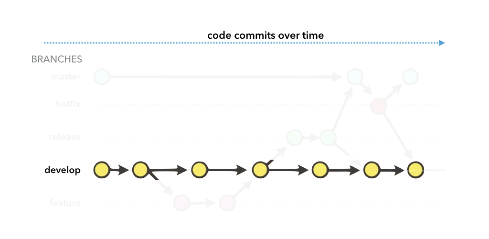

---?image=http://f52.tech/_nuxt/img/f52_welcome.2393ff7.jpg&size=cover

Débuter avec Git et Git-flow

##  Débuter avec git et git-flow

Cédric Foellmi – F52 Technologies cedric@f52.tech – http://f52.tech

---

## Table des matières

* Les principes de git
* Les commandes de base
* Le git-flow

* Les remotes et les plateformes (GitHub...)
* Collaborer

* Quelques exemples de clients
* Un fork sur GitHub

---

Historique 1

Git a débuté en 2005 après que Linus Torvald, le créateur de Linux, a dû
renoncé à son système de contrôle de version, devenu payant.

"git" veut dire "personne désagréable" en anglais argotique.

> I'm an egotistical bastard, and I name all my projects after myself. First 'Linux', now 'git'.

-- Linus Torvald

---

Historique 2

* le développement commença le **3 avril 2005**,
* il fut annoncé **le 6**,
* est devenu son propre contrôleur de version **le 7**,
* le premier `merge` eut lieu **le 18**,
* **le 29**, les objectifs de performance sont atteints
* **le 16 juin**, git gère la release du kernel Linux 2.6.12
* **le 26 juillet**, la maintenance est transferrée à Junio Hamano...
* la v1.0 sort le **21 décembre**.

<small>Source: Wikipedia</small>

---

## Les Principes

---

Les principes I

### git est un système de contrôle de version *distribué*.

Avantages:

* Pas besoin de serveur central, pas de "single point of failure"
* Permet de continuer à travailler hors-ligne
* Cloner un dépôt signifie obtenir l'entierté du projet, historique compris.
* **(Presque) tout se passe "localement"**

---

Les principes II

### git fonctionne comme un mini "système de fichiers".

* Les fichiers eux-mêmes sont conservés au moment du `commit`, pas seulement des différences
* Git est conçu pour le code, et le texte. Pas pour les binaires (images, PDFs...)

Diff | Git
---- | ---
 | 

---

Les principes III

### git assure une entière intégrité des données

* Git "checksum" tout avant de commiter.
* Git généralement ajoute des données. Il est très difficile de retirer (ou de perdre) quelque chose, une fois commité.

---

Les principes IV

### git fonctionne avec 3 niveaux

* **commité**: le fichier est enregistré dans la chaîne de commits.
* **staged** ou mis à l'index: le fichier est marqué pour partir avec le prochain wagon/commit.
* **modifié**: le fichier est différent de sa précédente copie.

<small>Logiquement, tout fichier nouveau, renommé, déplacé ou effacé est considéré comme "modifié".</small>

<small>Sauf s'il est **ignoré**...</small>

---
Les principes IV (image)

### git fonctionne avec 3 niveaux

---

Les principes V

### Les différents états pour les fichiers

---

## Des questions sur Les Principes ?

---

## Ok, les bases

---

Un (tout petit) peu de config

### Un (tout petit) peu de config

<small>Pas obligatoire mais évite des soucis par la suite.</small>

* Le fichier **`.gitignore`** permet de lister tous les fichiers ou "motifs de fichiers" à ignorer.
* @fa[arrow-right] https://www.gitignore.io

* Tapez une fois, les 2 commandes: 
**`git config --global user.name "John Doe"`** 
**`git config --global user.email johndoe@example.com`**

---

Les commandes vraiment de base

### La base de la base:

`git init`, &nbsp; &nbsp; &nbsp; `git add`, &nbsp; &nbsp; &nbsp;  `git commit`

Boum.

<small>Mais aussi: `git ignore`, et `git status`.</small>

---

Le coeur de git

### Le coeur de git

* **`clone`**: Littéralement. A ne pas confondre avec `checkout` (ni le `checkout` de CVS) !
* **`branch`**: instantané, ne coûte rien, facile (juste un pointeur).
* **`checkout`** =  change de branche.
* **`merge`**: on merge toujours vers soi !

---

Le coeur de git: exemple

 Dépôt d'exemple sur GitHub

---

## Des questions sur Les Bases ?

---

## Ok, le git-flow

---

git-flow

### Le git-flow est une "bonne pratique" courante.

<small>Pas une obligation, mais quand autant de monde s'y convertit...</small>

Plusieurs versions, plus ou moins complexes. A vous de trouvez la vôtre!

@fa[arrow-right] https://danielkummer.github.io/git-flow-cheatsheet/

**`git flow init`**

---

git-flow - 1

---

git-flow - 2

---

git-flow - 3

---

git-flow - 4

---

git-flow - 5

---

git-flow - config

### git-flow config

<table style="width: 100%">
<tr>
<th>Init</th><th>Config</th><th>Use</th>
</tr>
<tr>
<td width="20%"></td>
<td width="60%"></td>
<td width="20%"></td>
</tr>
</table>

---

tags & hooks

### Les Tags et les Hooks

* Des outils puissants.
* Les portes d'entrée vers l'intégration continue, et l'industrialisa
* semver, ça vous parle ? @fa[arrow-right] https://semver.org

---

## Des questions sur Le git-flow ?

---

## Ok, les remotes et la collaboration

---

git remote

### Oui, il peut y en avoir plusieurs

Exemple:

...

---

## Des questions sur les remotes et la collaboration ?

---

## Ok, les extras et le fork sur GitHub

---

Quelques clients

### Quelques clients

* GitKraken
* Tower
* SourceTree
* TortoiseGit

---

github-fork - 1

Ce framework a l'air intéressant. Clic pour faire un fork !

---

github-fork - 2

J'ai maintenant une copie entière du projet, avec ma propre adresse `.git`.
C'est sur ma copie que je fais des changements.

---

Une fois satisfait des changements, je soumets une "Pull Request".
Une discussion prend place.

github-fork - 3

---

Chaque ligne modifiée peut être (âprement) discutée.
Le projet source n'a subit strictement aucune altération.

github-fork - 4

---

Si je donne accès en écriture à ma PR, l'auteur peut participer aux changements,
par des commits.

github-fork - 5

---

Quand l'auteur décide que les changements sont prêts à être intégrés (en supposant
  que tous les outils d'intégration continue mis en place pour ce projet soient au vert...),
  la PR est "mergée"/"fusionnée" et apparaît dans l'historique du projet initial.

  Tout le monde peut maintenant profiter des changements que j'ai proposé.

github-fork - 6

---

## Merci !

#### Des questions finales ?
